<picture>
  <source media="(prefers-color-scheme: dark)" srcset="./assets/terminal-dark.svg">
  
</picture>

### `~/now`

- Building **[NoPing](https://noping.com)**, network optimization for online gaming, across backend, frontend and infra.
- Running agents in the dev loop: Claude Code with custom skills and hooks, MCP servers and scheduled agent routines.
- Experimenting with multi-agent orchestration and local models on Ollama.

### `~/public`

- [**dotfiles**](https://github.com/rafamancan/dotfiles): Neovim (Lua), zsh and the terminal setup I use every day
- [**zmk-config**](https://github.com/rafamancan/zmk-config): ZMK firmware for my wireless split keyboard
- [**rafamancan.github.io**](https://github.com/rafamancan/rafamancan.github.io): personal site

### `~/contact`

[rafamancan.github.io](https://rafamancan.github.io) · [LinkedIn](https://linkedin.com/in/rafaelmancan) · [X](https://x.com/rafamancan) · [rafael.mancan@gmail.com](mailto:rafael.mancan@gmail.com)

`:wq` · in games I'm Poynco 🐷
